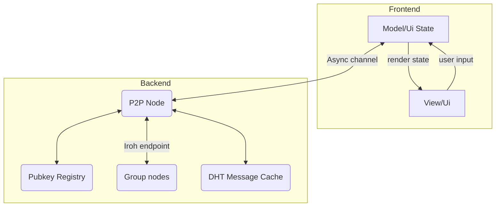

# Juus - "Just Us"

P2P social group chat platform. Principles: low latency, privacy and features that people will use.

## Architecture chart

```mermaid
flowchart TD
    subgraph Frontend
        X[Model/Ui State] -->|render state| B[View/Ui]
        B -->|user input| X
    end
    subgraph Backend
        C(P2P Node) <--> D(Pubkey Registry)
        C <-->|Iroh endpoint| E(Group nodes)
        C <--> F(DHT Message Cache)
    end
    X <-->|Async channel| C
```
