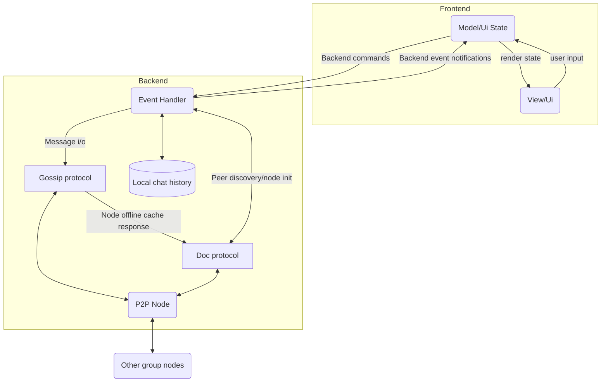

# Juus - "Just Us"

P2P social group chat platform.

**Principles:**
- low latency
- privacy
- features that users will actually use

## Architecture chart

```mermaid
flowchart TD
    subgraph Frontend
        X(Model/Ui State) -->|render state| B(View/Ui)
        B -->|user input| X
    end
    subgraph Backend
        C(Event Handler) -->|Message i/o|G
        G[Gossip protocol] <--> Y(P2P Node)
        G -->|Node offline cache response| H
        H[Doc protocol] <--> Y
		C <-->|Peer discovery/node init| H
        C <--> Z[(Local chat history)]

    end
    X -->|Backend commands|C(Event Handler)
    C -->|Backend event notifications|X
    Y <--> E(Other group nodes)
```
